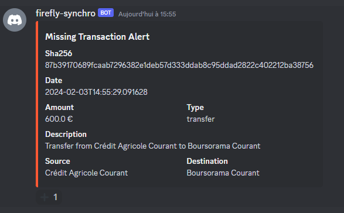
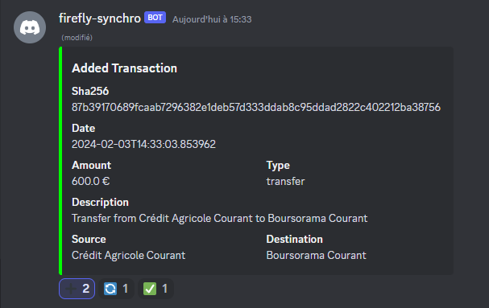

# discord microservice

This microservice is responsible for interacting with user via discord.

It send notfication when a transaction is missing.
The user can choose to ignore the notification or to synchronize the transaction by clicking the ➕ reaction.

If the user choose to synchronize the transaction, the synchronizer microservice will be called and the discord bot will send a message to the user to inform him of the result when the transaction is added.

